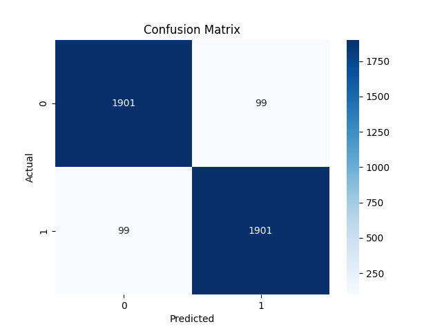
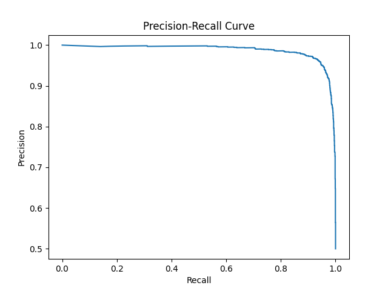
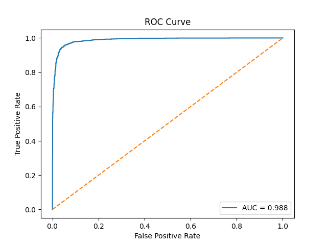

# 🖼️ AI Generated Image Detector

Detection of **AI-generated vs real images** using deep learning with **multi-domain feature representations**.

This project explores different deep learning approaches for detecting AI-generated images and compares their performance.  
The final system combines **RGB features, gradient artifacts, and frequency-domain information** with a **ResNet18 backbone**, achieving **95.05% accuracy** on a subset of the **CIFAKE dataset**.

---

# 📌 Overview

Recent generative models such as **GANs** and **diffusion-based models** can produce highly realistic synthetic images. Detecting such images has become an important task in:

- 🔍 **Digital forensics**
- 📰 **Misinformation detection**
- 🤖 **AI safety and authenticity verification**

This project investigates three different approaches:

1. **CNN trained from scratch**
2. **Transfer learning using ResNet18**
3. **Multi-domain feature architecture (RGB + Gradient + FFT) with ResNet18**

The final approach significantly improves performance by combining **spatial, edge, and frequency-domain information**.

---

# 📂 Dataset

This project uses a **subset of the CIFAKE dataset**.

🔗 Dataset source:  
https://www.kaggle.com/datasets/birdy654/cifake-real-and-ai-generated-synthetic-images

## Dataset Subset Generation

The original CIFAKE dataset contains a much larger number of images.  
Since training on the full dataset can be time-consuming on CPU, a **smaller subset** was created for experimentation and faster iteration.

A custom script **`create_subset.py`** was used to randomly sample images from the original dataset and generate a smaller training and testing split.

### Dataset Structure

```
data
│
├── train_small
│ ├── real
│ └── fake
│
└── test_small
├── real
└── fake
```

### Dataset Size

**Training subset**
- Real images: **5000**
- Fake images: **5000**

**Test subset**
- Real images: **2000**
- Fake images: **2000**

---

# 🧠 Methods Compared

Three different architectures were trained and evaluated.

---

## 1️⃣ CNN (Trained from Scratch)

A simple convolutional neural network was trained directly on **gradient images**.

### Result

**Accuracy:** `76%`

### Limitations

- Limited feature representation
- Training from scratch requires more data
- Struggles to capture complex patterns in generated images

---

## 2️⃣ Transfer Learning (ResNet18)

A pretrained **ResNet18** model was used with transfer learning.

### Modifications

- Final classification layer modified for **binary classification**

### Result

**Accuracy:** `87%`

### Benefits

- Pretrained features capture general visual patterns
- Faster convergence compared to training from scratch

---

## 3️⃣ Multi-Domain Architecture (RGB + Gradient + FFT)

The final approach combines **three complementary feature domains**:

| Feature | Purpose |
|------|------|
| RGB | Captures textures and color information |
| Gradient | Detects structural artifacts using Sobel edges |
| FFT (Frequency domain) | Reveals periodic artifacts introduced by generative models |

### Input Representation

[R, G, B, Gradient, FFT]

Input shape:

5 × 224 × 224


The combined tensor is fed into **ResNet18** with a modified first convolution layer to accept **5 input channels**.

### Result

**Accuracy:** `95.05%`

This demonstrates that combining multiple domains significantly improves detection performance.

---

# ⚙️ Training Configuration

| Parameter | Value |
|---|---|
Backbone | ResNet18 |
Input Size | 224 × 224 |
Batch Size | 8 |
Optimizer | Adam |
Learning Rate | 0.0001 |
Epochs | 10 |
Device | CPU |

---

# 📊 Performance Comparison

| Model | Accuracy |
|---|---|
CNN (from scratch) | **76%** |
ResNet18 Transfer Learning | **87%** |
RGB + Gradient + FFT + ResNet18 | **95.05%** |

---

# 🔍 Explainability

The project also includes **Grad-CAM visualization** to understand which regions influence the model’s predictions.

Grad-CAM highlights regions that contain patterns typical of **AI-generated artifacts**.


---

# 📈 Evaluation Metrics

The evaluation pipeline produces several metrics to assess the model's ability to distinguish between real and AI-generated images.

---

## Confusion Matrix

The confusion matrix shows the number of correct and incorrect predictions made by the model.



---

## Precision–Recall Curve

The Precision–Recall curve highlights the trade-off between **precision and recall** across different thresholds.



---

## ROC Curve

The **ROC (Receiver Operating Characteristic)** curve shows the model's performance across different classification thresholds.



---

# 📁 Project Structure

```
AI_Image_Classifier
│
├── data
|   |── train
|   |── test
|   |
│   ├── train_small
|   |   ├── real
|   |   └── fake
|   |
│   └── test_small
|       ├── real
|       └── fake
│
├── src
|   ├── create_subset.py
│   ├── dataset.py
│   ├── model.py
│   ├── train.py
│   ├── evaluate.py
│   └── gradcam.py
│
├── best_model_rgb_grad_fft.pth
└── requirements.txt
```
---

# 🚀 Installation

Clone the repository:

```
git clone https://github.com/yourusername/ai-generated-image-detector.git
cd ai-generated-image-detector
Clone the repository:
```
Install dependencies:
```
pip install -r requirements.txt
```
## 🏋️Training

Run training:

```
cd src
python train.py
```

## 📊Evaluation

To run evaluation metrics:

```
python evaluate.py
```

## 🔬Grad-CAM Visualization

To visualize model attention:
```
python gradcam.py
```
This produces heatmaps showing which regions influenced the prediction.
---

# 🛠️Technologies Used

- 🐍 **Python**
- 🔥 **PyTorch**
- 📷 **OpenCV**
- 🔢 **NumPy**
- 📊 **Matplotlib**
- 🤖 **Scikit-learn**
- 🎯 **TorchCAM**

---

# 👨‍💻 Author

This project was developed to explore deep learning techniques for detecting AI-generated images using multi-domain feature representations.
